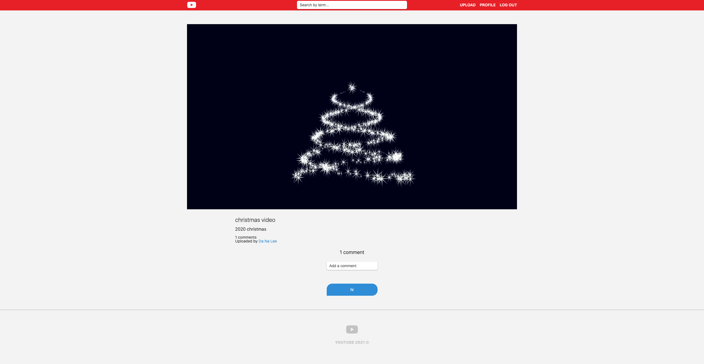

[](https://travis-ci.com/nibble2/youtube)

# youtube clone

## Description

유튜브 클론코딩한 프로젝트입니다.

---

## Project

[heroku에 배포 결과](https://calm-citadel-50531.herokuapp.com/)<br />
현재 무료 버전을 사용하고 있어 아마 페이지가 안뜰 가능성 99%라고 예상합니다.
aws ec2에 배포하려고 준비중이니 조금만 기다려주세요 😭 <br />
만약 배표 결과를 확인 하고싶으시면 제 이메일로 연락주세요.

## 

---

## Version

```
pug       : v3.0.0
node.js   : v14.11.0.
mongdb    : v4.2.0
mongoose  : v5.10.18
heroku    : v7.47.6
```

---

## Install

```
npm install
```

---

## Project start

```
build mode  : npm start build
dev mode    : npm run dev:server, npm run dev:assets
```

---

## Pages

- Home
- Join
- Login
- Search
- User Detail
- Edit Profile
- Change Password
- Upload
- Video Detail
- Edit Video

---

## More develop

[유튜브 클론코딩 노션](https://www.notion.so/nibble2/e5d617c7b1204da7bee531b0a13a85eb)
